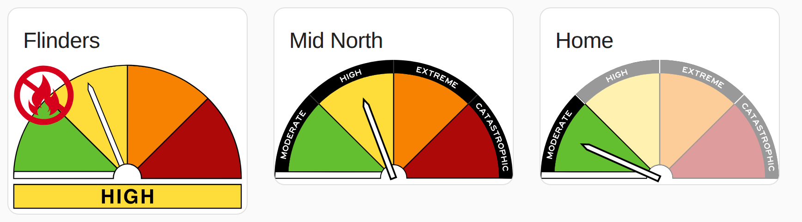
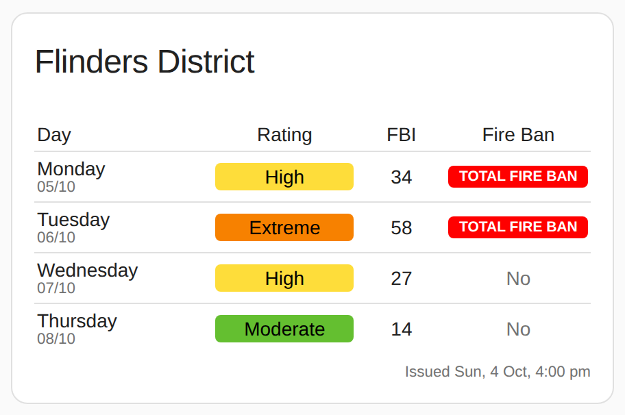
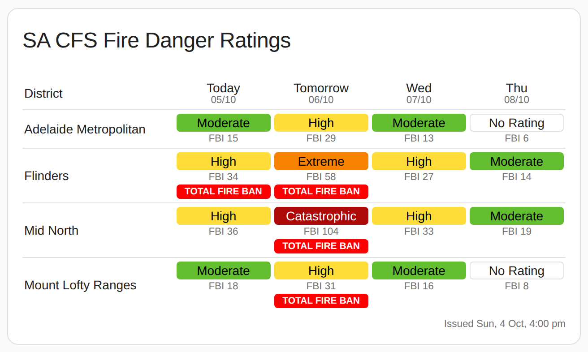
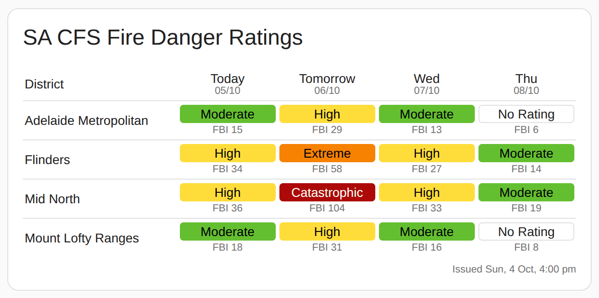

# Home Assistant - SA CFS Fire Danger
Home Assistant Custom Integration to pull SA CFS Fire Danger Ratings and Fire Ban information.

[](https://github.com/KablammoNick/homeassistant.sa_cfs_fire_danger/releases)
[](https://github.com/KablammoNick/homeassistant.sa_cfs_fire_danger/releases)
[](https://github.com/KablammoNick/homeassistant.sa_cfs_fire_danger/commits/master)
[](https://github.com/KablammoNick/homeassistant.sa_cfs_fire_danger)


## WARNING
This integration is still in development and rapid changes may break things!

It's also almost 99% generated by LLM's, so likely a bit sloppy.

If you're here, you've probably been sent the link to test for me, or you're very very lost.

## Installation
Install as a custom repository in HACS, and the config flow will let you select which districts you want to monitor.

Three [dashboard cards](#dashboard-cards) come with the integration and load automatically. You don't need to install any other custom cards.

> **v0.2.0 is a breaking change.** Entity IDs and attributes have changed (see below). Old `sensor.sa_cfs_<district>` entities are removed automatically; update your dashboards and automations.

## Data Refresh
The CFS feed is fetched every 60 minutes. `sensor.sa_cfs_fire_danger_summary` shows when the CFS issued the current forecast.

Days always follow the **South Australian local date**: `day_1` is today in Adelaide, `day_2` is tomorrow, and so on. If the feed has more than one forecast period for the same date, the latest one is used. If the feed has no forecast for a date (it usually covers about 4–5 days), that day's attributes are empty (`null`). Later days are not shifted forward to fill the gap.

## CFS Fire Ban Districts
1. Adelaide Metropolitan
2. Mount Lofty Ranges
3. Kangaroo Island
4. Mid North
5. Yorke Peninsula
6. Murraylands
7. Riverland
8. Upper South East
9. Lower South East
10. Flinders
11. North East Pastoral
12. Eastern Eyre Peninsula
13. North West Pastoral
14. Lower Eyre Peninsula
15. West Coast

## Fire Danger Ratings
The AFDRS has 5 levels of rating. Each has a numeric `level`, so automations can compare them (for example `level >= 2` means High or worse):

| Rating | Level |
| :-- | :-: |
| No Rating | 0 |
| Moderate | 1 |
| High | 2 |
| Extreme | 3 |
| Catastrophic | 4 |

## Summary sensor: `sensor.sa_cfs_fire_danger_summary`
Always created. Its state is the time the CFS issued the forecast, as a timestamp, so HA shows it in your local format.

| Attribute | Example | Comments |
| :-- | :-- | :-- |
| `district_count` | 15 | |
| `day_1_name` … `day_5_name` | Monday | Day names for table headings (SA local date) |
| `day_1_date` … `day_5_date` | 05/10 | dd/mm for table headings |
| `districts` | see below | Today's values for all 15 districts |

```yaml
districts:
  flinders: {name: Flinders, rating: High, level: 2, fbi: 30, fire_ban: true}
  mount_lofty_ranges: {name: Mount Lofty Ranges, rating: Moderate, level: 1, fbi: 15, fire_ban: false}
  # ...one entry for each of the 15 districts
```

## District devices
Each district you select in the config flow becomes a device, **SA CFS &lt;District&gt;**, with these entities:

| Entity | State |
| :-- | :-- |
| `sensor.sa_cfs_<district>_fire_danger_rating` | Today's rating (enum: No Rating / Moderate / High / Extreme / Catastrophic) |
| `sensor.sa_cfs_<district>_fire_behaviour_index` | Today's FBI (number) |
| `binary_sensor.sa_cfs_<district>_total_fire_ban_today` | `on` when a total fire ban is declared today |
| `binary_sensor.sa_cfs_<district>_total_fire_ban_tomorrow` | `on` when a total fire ban is declared tomorrow |

The rating sensor has these attributes:

| Attribute | Example | Comments |
| :-- | :-- | :-- |
| `district_name` | Flinders | |
| `level` | 2 | Today's level, 0–4 |
| `day_N_rating` | High | N = 1 (today) to 5 |
| `day_N_level` | 2 | |
| `day_N_fbi` | 30 | number |
| `day_N_fire_ban` | true | boolean |
| `forecast` | list | One entry per day the feed has: `{date: "2026-10-05", day: Monday, rating, level, fbi, fire_ban}` |

Template examples:
```yaml
{{ states('sensor.sa_cfs_flinders_fire_danger_rating') }}
{{ state_attr('sensor.sa_cfs_flinders_fire_danger_rating', 'day_2_rating') }}
{{ state_attr('sensor.sa_cfs_flinders_fire_danger_rating', 'forecast')[1].rating }}
{{ is_state('binary_sensor.sa_cfs_flinders_total_fire_ban_tomorrow', 'on') }}
```

### Upgrading from v0.1.x
| Old | New |
| :-- | :-- |
| `sensor.sa_cfs_fire_danger` (state "HH:MM dd/mm/YYYY") | `sensor.sa_cfs_fire_danger_summary` (timestamp) |
| `<district>_rating` / `_fbi` / `_fireban` on the summary | `districts.<district>.rating` / `.fbi` / `.fire_ban` |
| `sensor.sa_cfs_<district>` | `sensor.sa_cfs_<district>_fire_danger_rating` |
| `day_N_fireban` = "Yes"/"No" | `day_N_fire_ban` = true/false |
| `day_N_name` / `day_N_date` on district sensors | Use the summary sensor's `day_N_name` / `day_N_date` |
| `sensor.sa_cfs_fire_danger_issued` (v0.2.0/0.2.1) | `sensor.sa_cfs_fire_danger_summary` (from v0.2.2) |
| Template binary sensor for today's fire ban | `binary_sensor.sa_cfs_<district>_total_fire_ban_today` |

## Dashboard cards
These cards come with the integration. Add them from the card picker (search for "SA CFS"). Every option can be set in each card's visual editor or in YAML. In the YAML examples below, the values shown are the defaults.

| Card | Shows |
| :-- | :-- |
| [Gauge Card](#gauge-card) | Today's rating for one district as a gauge |
| [District Forecast Card](#district-forecast-card) | Day-by-day forecast for one district |
| [Forecast Table Card](#forecast-table-card) | Multi-day forecast for several districts |

### Gauge Card
Shows today's rating as a gauge, in one of three styles, with an optional fire ban icon when there is a total fire ban today. The title defaults to the district name. You can change it or hide it.



Card picker name: "SA CFS Fire Danger Gauge Card".

```yaml
type: custom:sa-cfs-fire-danger-card
entity: sensor.sa_cfs_flinders_fire_danger_rating
image_set: Gauge 1        # Gauge 1 / Gauge 2 / Gauge 3
overlay_fire_ban: false   # fire ban icon in the corner when there's a total fire ban today
show_title: true          # card title
# title: Home             # optional; defaults to the district name
```

The examples above show Gauge 1 with the fire ban icon, Gauge 2, and Gauge 3 with a custom title.

### District Forecast Card
Shows one district with one row per day: the rating, FBI and fire ban. Day names and dates come from the integration, so they always match the data. Click a row to open the district's details.



Card picker name: "SA CFS Fire Danger District Forecast".

```yaml
type: custom:sa-cfs-fire-danger-district-card
entity: sensor.sa_cfs_flinders_fire_danger_rating
days: 4                 # 1-5
today_tomorrow: false   # true = first two rows say Today / Tomorrow instead of day names
show_title: true
# title: Flinders       # optional; defaults to "<District> District"
show_dates: true        # dd/mm under each day name
show_fbi: true          # FBI column
show_fire_ban: true     # Fire Ban column
show_footer: true       # "Issued ..." footer
```

### Forecast Table Card
Shows several districts over several days. Each cell shows the rating colour, the FBI, and a fire ban notice when there is one. The column headings come from the integration, so they always match the data. Click a district name to open its details.

All day columns are the same width. In narrow columns, text shrinks to fit, "TOTAL FIRE BAN" becomes "FIRE BAN" and "Tomorrow" becomes "Tmrw".



With `fire_ban_display: flash`, the rating and the fire ban take turns in the same box:



Card picker name: "SA CFS Fire Danger Table".

```yaml
type: custom:sa-cfs-fire-danger-table-card
title: SA CFS Fire Danger Ratings
days: 4                    # 1-5
today_tomorrow: true       # false = day names for every column (Mon, Tue, ...)
show_fbi: true             # FBI under each rating
show_dates: true           # dd/mm under each day heading
show_footer: true          # "Issued ..." footer
show_fire_ban: true        # show total fire bans
fire_ban_display: banner   # banner = red banner below the rating
                           # flash  = the rating and FIRE BAN alternate in the same box
flash_interval: 1          # seconds each is shown when fire_ban_display is flash
# entities:                # optional; defaults to every district you selected, sorted by name
#   - sensor.sa_cfs_flinders_fire_danger_rating
#   - sensor.sa_cfs_mount_lofty_ranges_fire_danger_rating
```

## Other dashboard examples
You can also build displays from the sensors with standard and third-party cards. These examples use the Flinders district.

### Picture Entity
A picture entity card can show the coloured wheel. Three SVG gauge styles are included, or you can use your own.

For the other styles, change `gauge1` to `gauge2` or `gauge3`.

```yaml
type: picture-entity
entity: sensor.sa_cfs_flinders_fire_danger_rating
fit_mode: contain
show_state: false
show_name: false
state_image:
  unknown: /hacsfiles/sa_cfs_fire_danger/afdr-gauge1-unknown.svg
  No Rating: /hacsfiles/sa_cfs_fire_danger/afdr-gauge1-norating.svg
  Moderate: /hacsfiles/sa_cfs_fire_danger/afdr-gauge1-moderate.svg
  High: /hacsfiles/sa_cfs_fire_danger/afdr-gauge1-high.svg
  Extreme: /hacsfiles/sa_cfs_fire_danger/afdr-gauge1-extreme.svg
  Catastrophic: /hacsfiles/sa_cfs_fire_danger/afdr-gauge1-catastrophic.svg
```

### Picture Elements with Fire Ban overlay
Shows the coloured wheel as above, with a fire ban icon when there is a total fire ban today.


```yaml
type: picture-elements
image: /hacsfiles/sa_cfs_fire_danger/afdr-gauge1-norating.svg
elements:
  - type: image
    entity: sensor.sa_cfs_flinders_fire_danger_rating
    state_image:
      unknown: /hacsfiles/sa_cfs_fire_danger/afdr-gauge1-unknown.svg
      No Rating: /hacsfiles/sa_cfs_fire_danger/afdr-gauge1-norating.svg
      Moderate: /hacsfiles/sa_cfs_fire_danger/afdr-gauge1-moderate.svg
      High: /hacsfiles/sa_cfs_fire_danger/afdr-gauge1-high.svg
      Extreme: /hacsfiles/sa_cfs_fire_danger/afdr-gauge1-extreme.svg
      Catastrophic: /hacsfiles/sa_cfs_fire_danger/afdr-gauge1-catastrophic.svg
    tap_action: none
    hold_action: none
    style:
      left: 50%
      top: 50%
      width: 100%
      height: 100%
  - type: conditional
    conditions:
      - entity: binary_sensor.sa_cfs_flinders_total_fire_ban_today
        state: "on"
    elements:
      - type: image
        entity: binary_sensor.sa_cfs_flinders_total_fire_ban_today
        state_image:
          "on": /hacsfiles/sa_cfs_fire_danger/fire_ban.svg
        tap_action: none
        hold_action: none
        style:
          transform: none
          left: 0%
          top: 0%
          width: 25%
          height: 100%
```

### Single District Forecast Entity List
The [District Forecast Card](#district-forecast-card) above does this without any other custom cards. This version is kept for reference.

Needs [multiple-entity-row](https://github.com/benct/lovelace-multiple-entity-row) and [config-template-card](https://github.com/iantrich/config-template-card). config-template-card reads the day names from the summary sensor.


```yaml
type: custom:config-template-card
variables:
  DAY1_NAME: states['sensor.sa_cfs_fire_danger_summary'].attributes.day_1_name
  DAY2_NAME: states['sensor.sa_cfs_fire_danger_summary'].attributes.day_2_name
  DAY3_NAME: states['sensor.sa_cfs_fire_danger_summary'].attributes.day_3_name
  DAY4_NAME: states['sensor.sa_cfs_fire_danger_summary'].attributes.day_4_name
entities:
  - sensor.sa_cfs_flinders_fire_danger_rating
card:
  type: entities
  title: Flinders District
  entities:
    - entity: sensor.sa_cfs_flinders_fire_danger_rating
      type: custom:multiple-entity-row
      show_state: false
      name: ${DAY1_NAME}
      entities:
        - attribute: day_1_rating
          name: Rating
        - attribute: day_1_fbi
          name: FBI
        - attribute: day_1_fire_ban
          name: Fire Ban
    - entity: sensor.sa_cfs_flinders_fire_danger_rating
      type: custom:multiple-entity-row
      show_state: false
      name: ${DAY2_NAME}
      entities:
        - attribute: day_2_rating
          name: Rating
        - attribute: day_2_fbi
          name: FBI
        - attribute: day_2_fire_ban
          name: Fire Ban
    - entity: sensor.sa_cfs_flinders_fire_danger_rating
      type: custom:multiple-entity-row
      show_state: false
      name: ${DAY3_NAME}
      entities:
        - attribute: day_3_rating
          name: Rating
        - attribute: day_3_fbi
          name: FBI
        - attribute: day_3_fire_ban
          name: Fire Ban
    - entity: sensor.sa_cfs_flinders_fire_danger_rating
      type: custom:multiple-entity-row
      show_state: false
      name: ${DAY4_NAME}
      entities:
        - attribute: day_4_rating
          name: Rating
        - attribute: day_4_fbi
          name: FBI
        - attribute: day_4_fire_ban
          name: Fire Ban
```

### Multiple District Forecast Table (with Fire Bans)
The [Forecast Table Card](#forecast-table-card) above does this without any other custom cards. This flex-table-card version is kept for anyone who wants to customise it further.

Needs [flex-table-card](https://github.com/custom-cards/flex-table-card) and config-template-card. It shows one row per district you selected.

The colour logic is written once as a YAML anchor (`&rating_cell`) and reused for each day. Anchors work in YAML-mode dashboards and in the card's code editor, but the HA UI expands them when it saves.


```yaml
type: custom:config-template-card
variables:
  DAY3_DATE: states['sensor.sa_cfs_fire_danger_summary'].attributes.day_3_date
  DAY4_DATE: states['sensor.sa_cfs_fire_danger_summary'].attributes.day_4_date
entities:
  - sensor.sa_cfs_fire_danger_summary
card:
  type: custom:flex-table-card
  title: SA CFS Fire Danger Ratings
  entities:
    include: sensor.sa_cfs_*_fire_danger_rating
  columns:
    - data: district_name
      name: District
    - data: day_1_rating, day_1_fire_ban
      name: Today
      align: center
      multi_delimiter: ","
      modify: &rating_cell |-
        var rating = String(x.split(',')[0]);
        var ban = String(x.split(',')[1]) == "true";
        var colours = {
          "Moderate": "background-color:#64bf30;color:#000000;",
          "High": "background-color:#fedd3a;color:#000000;",
          "Extreme": "background-color:#f78100;color:#000000;",
          "Catastrophic": "background-color:#ad0909;color:#FFFFFF;"
        };
        var cell = rating == "null" || rating == "undefined" || rating == "" ? "-"
          : colours[rating] ? '<div style="' + colours[rating] + '">' + rating + '</div>'
          : rating;
        ban ? cell + '<div style="background-color:#ff0000;">FIRE BAN</div>' : cell
    - data: day_1_fbi
      name: ""
      align: center
    - data: day_2_rating, day_2_fire_ban
      name: Tomorrow
      align: center
      multi_delimiter: ","
      modify: *rating_cell
    - data: day_2_fbi
      name: ""
      align: center
    - data: day_3_rating, day_3_fire_ban
      name: ${DAY3_DATE}
      align: center
      multi_delimiter: ","
      modify: *rating_cell
    - data: day_3_fbi
      name: ""
      align: center
    - data: day_4_rating, day_4_fire_ban
      name: ${DAY4_DATE}
      align: center
      multi_delimiter: ","
      modify: *rating_cell
    - data: day_4_fbi
      name: ""
      align: center
grid_options:
  columns: 24
```
